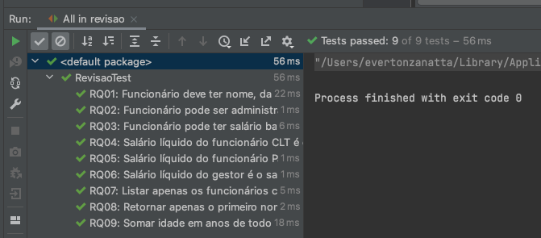

# Revisão

## Objetivo
Implementar o que for necessário para o projeto compilar e passar com sucesso todos os testes unitários.

## Requisitos
- RQ01: Funcionário deve ter nome, data de nascimento, tipo de contrato e salário base
- RQ02: Funcionário pode ser administrativo, técnico ou gestor
- RQ03: Funcionário pode ter salário base alterado
- RQ04: Salário líquido do funcionário CLT é o salário base menos 30% de desconto
- RQ05: Salário líquido do funcionário PJ é o salário base menos 10% de desconto
- RQ06: Salário líquido do gestor é o salário base menos o desconto do tipo de contrato e mais um bonus de 100 reais por cada subordinado
- RQ07: Listar apenas os funcionários com salário líquido menor que 3000
- RQ08: Retornar apenas o primeiro nome dos funcionários
- RQ09: Somar idade em anos de todos os funcionários
