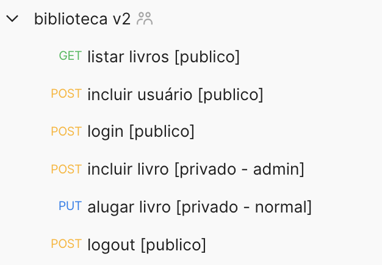

# Biblioteca v2

### Endpoints

### Outros

- `/data/data.sql`: Arquivo para criar objetos no banco e inserir dados de exemplo.
- `/data/postman`: Arquivos para importar no postman.
- `/data/docker-compose.yml`: Criar postgresql e pgadmin.
