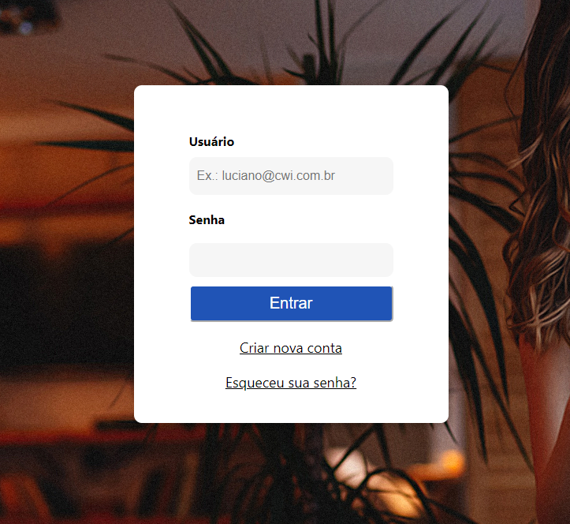
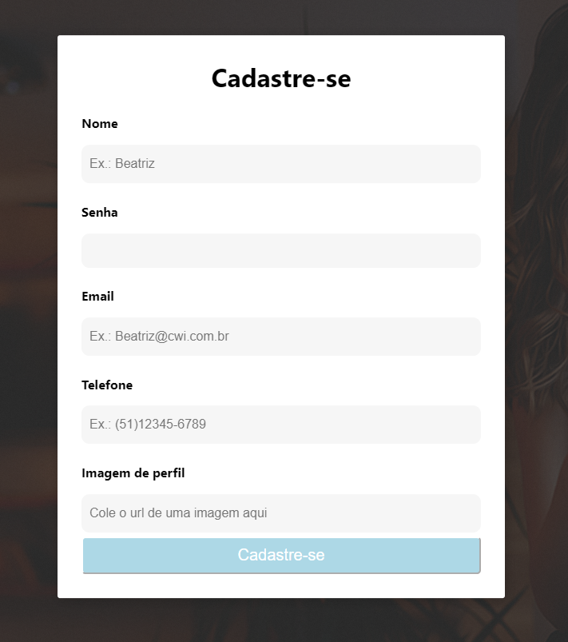
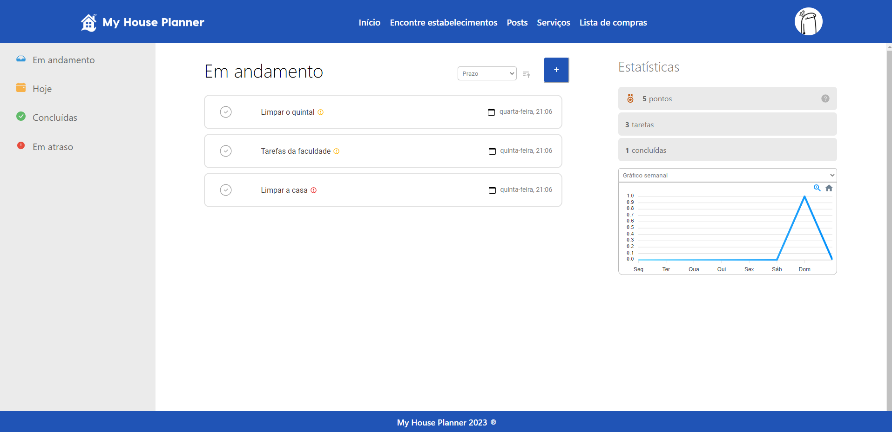
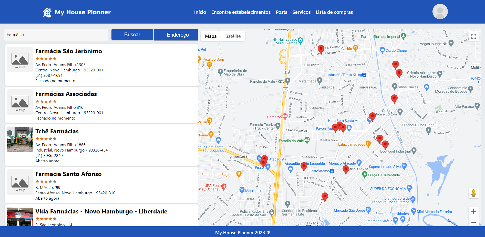
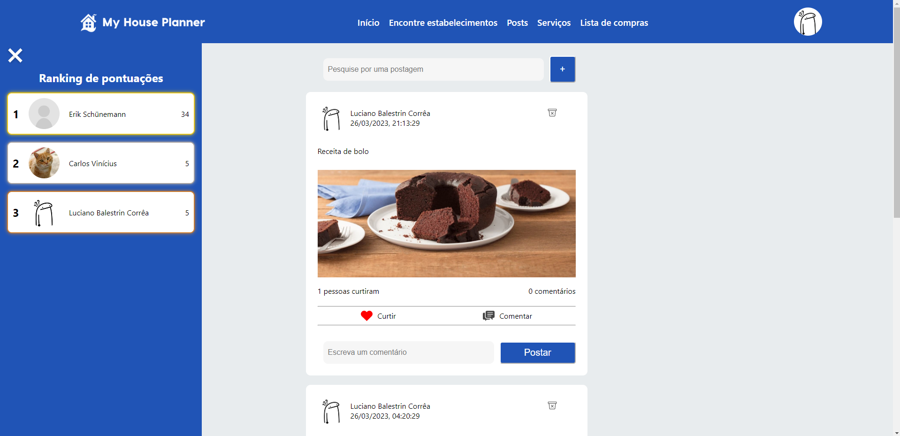
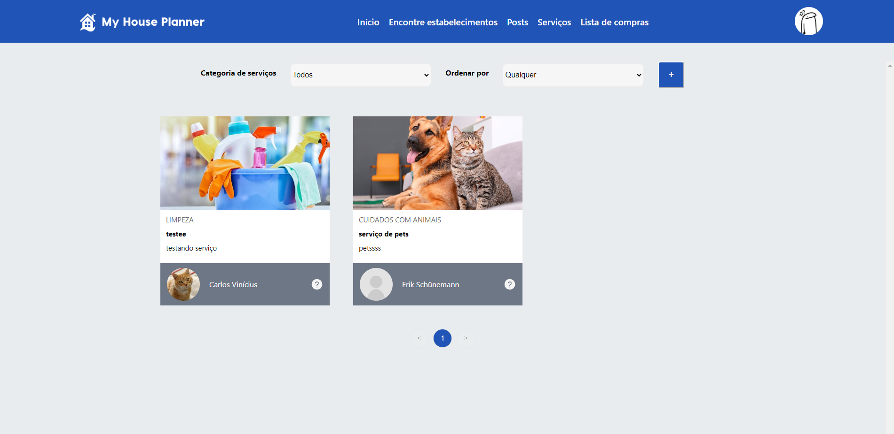
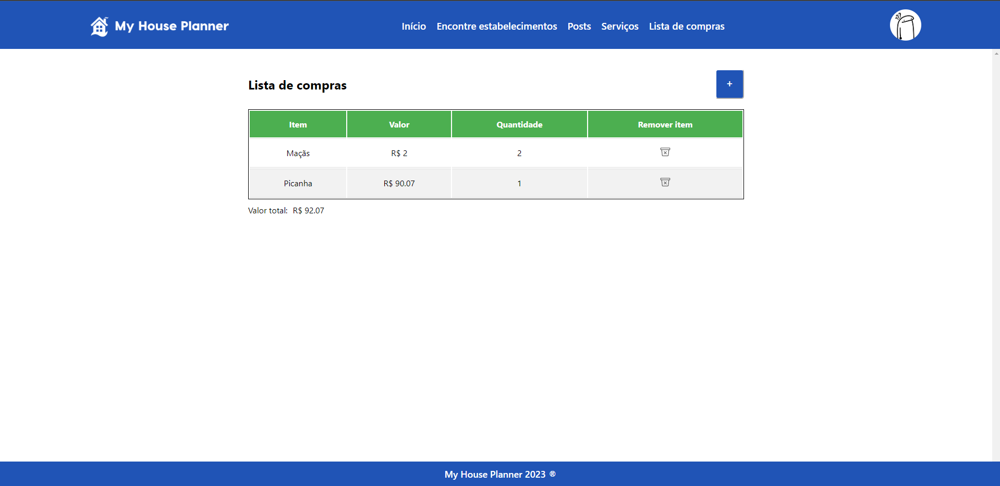

## Documentação do Front End

## Visão geral

A aplicação permite a criação, recuperação, atualização e remoção de tarefas, serviços, postagens e
itens de lista de compras. Além disso, ela também fornece recursos para curtir postagens, verificar se um usuário já
curtiu uma postagem e adicionar comentários em postagens.

Além disso, possui integração com o Google Maps, sendo possível o usuário informar seu endereço para localização exata ou permitir
que a aplicação pegue a localização aproximada do usuário, com isso, o usuário pode pesquisar serviços essenciais próximos a ele,
como farmácias, mercados e restaurantes.

Por fim, é realizado envio de e-mail diário para os usuários contendo informações e atualizações sobre as tarefas registradas pelo usuário.

### Para iniciar a aplicação

- Executar: `npm install` para baixar todas as dependências
- Após baixar todas as dependências, executar `npm start`

### Dependências utilizadas

- `Axios` para realizar se comunicar com `api`
- `React router dom` para criação de rotas personalizadas
- `React create global state` para salvar os dados do usuário no `LocalStorage`
- `React icons` para utilizar ícones personalizados
- `Apex charts` para criação de gráficos
- `Google maps API` para integrar Google Maps na aplicação
- `Quartz scheduler` para envio de e-mails
- `DayJS` para manipulação de datas e horários
- `React rating stars component` para representação de avaliações dos lugares pelos usuários google

### Autenticação na aplicação

Tela de login

Aqui o usuário pode informar seu e-mail e senha cadastrados anteriormente, caso ainda não tenha cadastro é possível clicar em "Criar nova conta" para iniciar o processo de cadastro.

Com isso, temos a seguinte tela

Aqui, o único campo opcional é a imagem de perfil, a qual pode ser trocada posteriormente também.

Por fim, caso o usuário tenha esquecido a sua senha, pode-se clicar em "Esqueceu sua senha?" e digitar o e-mail cadastrado, após isso, caso o e-mail seja válido, será enviado um e-mail contendo um token para redefinição de senha.

### Token

- Formato do token: `58e0a7d7-eebc-11d8-9669-0800200c9a66`
- Tempo de expiração: 30 minutos após o envio do e-mail, ou caso seja redefinido a senha, o token expira no momento em que a senha é trocada, sendo necessário enviar um e-mail novo

### Tela de tarefas

Essa é a principal tela da aplicação, é a primeira tela que o usuário vê quando entra

Aqui, na aba do lado esquerdo, estão presentes alguns filtros específicos que podemos utilizar para buscar as tarefas

No centro da página, temos todas as tarefas que satisfazem o filtro escolhido, podendo ser ordenadas também por prazo, prioridade ou data de criação.

Por fim, na direita, temos as estatísticas, basicamente um sistema de pontos por tarefas completadas, quantidade de tarefas e quantas forma concluídas, e por último, um gráfico das tarefas, podendo ser ordenado por semana, por mês ou por ano, tal gráfico representa as tarefas concluídas.

### Tela de encontre estabelecimentos

Nessa tela, o usuário pode digitar o seu endereço para uma localização exata, ou pode deixar o próprio sistema encontrar uma localização aproximada.

Com a localização, o usuário pode então buscar por estabelecimentos essenciais, como farácias, mercados e restaurantes.

### Tela de postagens

Na tela de postagens, no lado esquerdo tempo o ranking de pontuações, o qual consta todos os usuários da plataforma, é um menu lateral que pode ser aberto e fechado quando o usuário desejar.

E no centro da página estão todas as postagens realizadas pelos usuários, o qual os mesmos podem interagir com comentários ou até mesmo curtir a publicação.

### Tela de serviços

Na tela de serviços, os usuários que possuem algum conhecimento ou que sabem realizar limpezas, concertos e cuidar de animais, podem prestar serviços para as pessoas que utilizam a plataforma, ao clicar no serviço que o usuário deseja, são apresentados algumas informações do prestador de serviços, assim, o usuário poderia entrar em contato caso desejar, sendo por e-mail ou telefone.

Por fim, é possível pesquisar por alguns filtros, por exemplo, as categorias ou ordenar por valor, data da publicação, ou ordenar aleatóriamente.

E por fim, mas não menos importante, a aplicação conta ainda com uma lista de compras, na qual o usuário pode incluir novos itens e o valor dos mesmos.

Também é possível editar algum item já adicionado anteriormente ou remover da lista.
